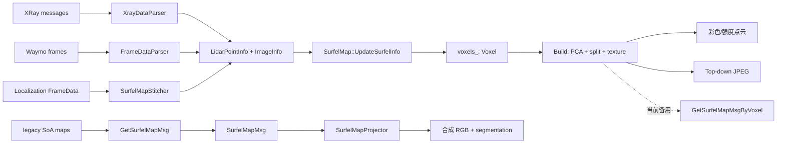

# Surfel Map 模块算法与代码实现设计文档

> 分析对象：`offboard/map/surfel_map`  
> 代码快照：2026-07-29 当前工作树  
> 文档性质：现状设计说明 + 静态代码审查  
> 说明：本文以代码真实调用关系为准；“预期设计”和“当前行为”不一致时会明确指出。

## 1. 文档摘要

`surfel_map` 将多帧激光点云按三维体素聚合，把每个满足条件的体素拟合为一个局部平面 surfel，再将平面离散成 `grid_size × grid_size` 个小格，从相机图像为小格采样颜色。最终结果可以输出为彩色点云、俯视图、序列化 protobuf，或通过逐像素射线与 surfel 求交重新渲染相机图像。

模块包含三条主要业务链：

1. `SurfelMapGenerator`：读取 XRay 或 Waymo 数据，生成静态和动态 surfel map。
2. `SurfelMapStitcher`：作为 localization map 构建流程的一部分，生成彩色/强度混合 surfel 点和 top-down 图。
3. `SurfelMapProjector`：加载序列化 surfel map，以射线投射方式合成彩色图和车辆分割图。

当前代码最重要的结构性事实是：`SurfelMap` 内部并存两套数据表示。

| 数据通路 | 核心容器 | 当前主要写入入口 | 当前主要输出 |
|---|---|---|---|
| Voxel 通路 | `std::unordered_map<int64_t, Voxel> voxels_` | `UpdateSurfelInfo()`、`Build()` | PCD、`LidarPointsMsg`、top-down 图 |
| legacy SoA 通路 | `surfel_centroids_`、`surfel_normals_`、`surfel_colors_` 等多个 map | `UpdateSurfelInfoByGroupData()` 及一组旧版估计函数 | `GetSurfelMapMsg()`、投影器加载后的查询 |

生成器和 stitcher 的现行建图入口写入 Voxel 通路，但 `SaveSerializedSurfelMap()` 仍调用 legacy 通路的 `GetSurfelMapMsg()`。因此，当前 CLI 的“序列化输出”和“PCD/top-down 输出”并不来自同一份数据；这是模块目前最需要优先解决的问题。

## 2. 模块目标与边界

### 2.1 解决的问题

普通点云只表示离散命中点。Surfel（surface element）在每个局部区域额外表示：

- 局部表面中心；
- 表面法向；
- 两个切平面基向量；
- 平面上的规则采样格；
- 不同观测距离下的颜色；
- 可选的 LiDAR 距离、强度、法向和细分信息。

这种表达同时适合：

- 从点云重建带纹理的局部表面；
- 生成俯视 RGB/强度地图；
- 相机视角重新渲染；
- LiDAR/相机仿真中的表面查询；
- 将静态背景和动态车辆分别建模。

### 2.2 不在本模块内完成的工作

- 定位、轨迹优化和传感器外参求解；
- 相机目标检测本身；
- localization map 的地面分割；
- 完整的遮挡推理和全局网格融合；
- 车道线检测或 BEV 语义模型推理。

这些结果由外部模块提供，`surfel_map` 只消费位姿、标定、点云、图像、障碍物和分割索引。

## 3. 目录与组件职责

### 3.1 核心库

| 文件 | 职责 |
|---|---|
| [`common.h`](../offboard/map/surfel_map/common.h) / [`common.cc`](../offboard/map/surfel_map/common.cc) | 定义点、图像、标定、车辆状态等跨组件数据结构；提供滚动快门曝光时间和短时间位姿外推 |
| [`voxel.h`](../offboard/map/surfel_map/voxel.h) / [`voxel.cc`](../offboard/map/surfel_map/voxel.cc) | 单体素的在线统计、PCA 平面拟合、网格生成、图像采色、多视角颜色融合和 Voxel 路径序列化 |
| [`surfel_map.h`](../offboard/map/surfel_map/surfel_map.h) / [`surfel_map.cc`](../offboard/map/surfel_map/surfel_map.cc) | 空间分桶、体素生命周期、递归细分、纹理构建、点云/top-down/proto 输出、射线与 surfel 相交 |
| [`dynamic_surfel_map.h`](../offboard/map/surfel_map/dynamic_surfel_map.h) / [`dynamic_surfel_map.cc`](../offboard/map/surfel_map/dynamic_surfel_map.cc) | 按目标 ID 管理动态物体观测、位姿和平均物体坐标系 |

### 3.2 输入解析

| 文件 | 职责 |
|---|---|
| [`xray_data_parser.cc`](../offboard/map/surfel_map/xray_data_parser.cc) | 对齐 XRay 中的点云、相机、定位和障碍物消息；运动补偿；过滤自车点和动态目标；可从 range image 估计点法向 |
| [`frame_data_parser.cc`](../offboard/map/surfel_map/frame_data_parser.cc) | 解析 Waymo frame；解压 range image；逐点恢复世界坐标；解析相机标定、图像和 rolling-shutter 参数 |
| [`waymo_dataset_loader.py`](../offboard/map/surfel_map/scripts/waymo_dataset_loader.py) | 将 Waymo TFRecord 拆分为逐帧 protobuf 文件 |

### 3.3 编排与输出

| 文件 | 职责 |
|---|---|
| [`surfel_map_generator.cc`](../offboard/map/surfel_map/surfel_map_generator.cc) | 组织离线输入、静态/动态建图和多种输出 |
| [`surfel_map_projector.cc`](../offboard/map/surfel_map/surfel_map_projector.cc) | 构建 PCL octree，逐像素发射射线，从 surfel 网格取色 |
| `*_cli.cc` | 命令行入口和可视化工具 |
| [`BUILD`](../offboard/map/surfel_map/BUILD) | Bazel target 与依赖图 |

### 3.4 数据协议与配置

| Proto/配置 | 用途 |
|---|---|
| [`surfel_map.proto`](../offboard/map/surfel_map/proto/surfel_map.proto) | Surfel、颜色网格、地图元数据和 compact map |
| [`scene_settings.proto`](../offboard/map/surfel_map/proto/scene_settings.proto) | 投影渲染所需的相机标定、相机位姿和动态物体位姿 |
| [`pointcloud_partition.proto`](../offboard/map/surfel_map/proto/pointcloud_partition.proto) | 点云空间分块消息；当前核心调用链未使用 |
| `dataset.proto`、`label.proto` | 模块内裁剪的 Waymo 数据结构 |
| [`surfel_map_generator_config.pb.txt`](../offboard/map/surfel_map/conf/surfel_map_generator_config.pb.txt) | 默认体素/网格/距离分层参数 |
| [`xray_data_parser_config.pb.txt`](../offboard/map/surfel_map/conf/xray_data_parser_config.pb.txt) | XRay topic、传感器名、range image 和时间参数 |

## 4. 总体架构



虚线体现当前实现中的断点：主建图链已经转到 `Voxel`，但序列化主入口仍连接 legacy SoA。

## 5. 核心数据模型

### 5.1 坐标系

代码中主要涉及四个坐标系：

- `world`：定位/UTM 世界坐标；
- `vehicle`：车体坐标；
- `camera` / `lidar`：传感器坐标；
- `map-local`：`world - map_origin`，用于降低大坐标数值并生成局部 map node。

核心约定是：

```text
p_map = p_world - map_origin
p_world = p_map + map_origin
p_camera = T_camera_vehicle^-1 · T_vehicle_world^-1 · p_world
```

`SurfelMap::UpdateSurfelInfo()` 存入 Voxel 的是 `map-local` 点。图像投影时 `Voxel::UpdateTexture()` 会重新加上 `map_origin_`。PCD、`LidarPointsMsg` 和 top-down 输出保留局部坐标，不会自动加回世界原点。

当外部没有调用 `SetMapOrigin()` 时，第一条有效点的世界坐标会成为 `map_origin_`。localization stitcher 则显式使用 geohash map node 中心作为原点，并设置 XY ROI。

### 5.2 输入结构

`LidarPointInfo` 携带：

- `position`：世界坐标；
- `range` / `depth`：点到 LiDAR 或相机的距离；
- `intensity`；
- 可选点法向、入射方向；
- 能看到该点的相机名列表。

`ImageInfo` 携带图像、动态目标 mask、URI、车辆位姿及 rolling-shutter 参数。`MultiFrameImageInfo` 的索引为：

```text
timestamp -> camera_name -> ImageInfo
```

`CameraCalibration` 保存相机模型、`camera -> vehicle` 外参和快门读出方向。

建议后续为这些 struct 的所有标量和 Eigen 成员提供显式默认值。当前默认构造后部分字段未初始化，某些输入路径没有逐项赋值。

### 5.3 Surfel 表达

一个已拟合的 Voxel 具有：

- 质心 `μ`；
- 协方差 `Σ`；
- 法向 `n`；
- 切平面基 `x_axis`、`y_axis`；
- `grid_size²` 个平面采样点；
- `camera -> distance_bin -> timestamp` 的首次观测；
- `camera -> distance_bin -> colored cells` 的纹理。

默认配置：

```text
resolution = 0.1 m
grid_size = 7
distance_bins = [0, 2, 5, 10, 20, 40, 60] m
rolling_shutter_compensation = true
min_num_points_in_voxel = 5
```

单元格间距为：

```text
cell_size = sqrt(3) * resolution / grid_size
```

因此整个平面 patch 的采样跨度约为体素空间对角线，而不是体素边长。这可以覆盖任意方向切过立方体的平面，但也会使相邻体素的 surfel patch 发生重叠。

## 6. 输入数据处理

### 6.1 XRay 数据链

`XrayDataParser::Initialize()` 完成以下工作：

1. 从 pb.txt 读取 topic、传感器名、时间范围和点云参数。
2. 从 XRay metadata 加载 sensor rig、相机模型、LiDAR/相机外参和自车轮廓。
3. 建立车辆位姿插值器和左右 LiDAR 运动补偿器。
4. 按配置构建 range image，用于点法向估计。

`ParseNextFrame()` 以 perception obstacles 的 LiDAR 时间为基准：

1. 在 ±20 ms 内匹配主 LiDAR；右 LiDAR 缺失只记日志。
2. 选择 100 ms 内最近相机帧。
3. 将左右 LiDAR 点云运动补偿到相机时间。
4. 从 pose interpolator 取得相机时间的车体位姿。
5. 解析图像和 shutter 参数。
6. 调用 `SetLidarPointsInfo()` 分类静态点和车辆点。

点过滤和分类规则：

- 去除距离 LiDAR 小于 2 m 的点；
- 可按自车 XY 多边形过滤自车回波；
- 去除相机距离超过 120 m 的点；
- 以膨胀 2 m 的 raw obstacle XY box 判断动态点；
- 行人、自行车等动态类别直接丢弃，只为车辆创建动态 surfel map；
- 通过相机 `Project()` 判断点是否具备相机观测；
- 可从 range image 中相邻的右、下点叉乘估计点法向。

range image 法向近似为：

```text
u = normalize(p_right - p)
v = normalize(p_down - p)
n = normalize(u × v)
```

### 6.2 Waymo 数据链

`FrameDataParser` 只处理 TOP LiDAR 的 first return：

1. zlib 解压 `[H,W,4]` range image、逐像素 pose 和相机投影。
2. 由 beam inclination、azimuth 和 range 恢复 LiDAR 点。
3. 通过每个 range-image cell 的 pose 将点变换到世界坐标。
4. 遍历 label box，将车辆点分配到目标 ID；行人和骑行者被丢弃。
5. 解码相机图像、标定和 rolling-shutter 参数。

Waymo 相机坐标采用 front-left-up，解析器通过固定旋转矩阵转换为模块相机模型使用的坐标约定。

当前 Waymo 路径没有给 `LidarPointInfo::range` 和 `intensity` 赋值，却会在后续距离分层和 Voxel 强度统计中读取这两个字段。这是未初始化数据风险，详见第 14 节。

### 6.3 Localization map stitcher 数据链

模块的另一实际入口位于
[`surfel_map_stitcher.cc`](../offboard/map/localization_map/builder/core/stitcher/surfel_map_stitcher.cc)。

它缓存 `FrameData`，根据 LiDAR 扫描相位估计各相机时间偏移，再把匹配帧转换成 `LidarPointInfo` 和 `ImageInfo`。外部地面分割索引将点分成 ground/non-ground；只保留 50 m 内的点。

相机检测框会生成 mask，置信度不低于 0.5 的车辆/轿车区域被置零，避免动态目标颜色污染静态 surfel。

当前 `Stitch()` 只对 `ground_surfel_map_` 执行 `Build()`，non-ground 的构建代码被注释，但 `GetSerializedMapData()` 仍输出 non-ground 点消息。因此现状下 non-ground 输出通常没有完整几何和纹理。

## 7. 体素聚合与空间索引

### 7.1 当前空间键

当前实现先计算三个整数：

```text
ix = int64(point.x / resolution)
iy = int64(point.y / resolution)
iz = int64(point.z / resolution)
id = ix XOR (iy << 26) XOR (iz << 52)
```

该值被用作 `unordered_map` 的唯一 key，而不只是 hash。这个编码并非无碰撞的三维索引：

- 浮点转整数向零截断，与 `GetSurfelCenter()` 使用 `floor()` 不一致；
- 负有符号整数左移在 C++ 中存在未定义行为；
- `z << 52` 在 64 位中只剩很少有效位；
- XOR 字段没有显式 mask，字段可能互相覆盖；
- 不同体素一旦产生相同 key，会被错误合并，无法再通过坐标辨别。

建议把 `(ix, iy, iz)` 保存为结构化 key，并仅在 `unordered_map` 的 hasher 中混合三个整数。

### 7.2 在线均值与协方差

`Voxel::Insert()` 不需要每次重扫历史点。设旧样本数为 `N`，均值为 `μ`，协方差为 `Σ`，新点为 `p`：

```text
sum_p   = N μ + p
sum_ppt = N (Σ + μ μᵀ) + p pᵀ

μ' = sum_p / (N + 1)
Σ' = sum_ppt / (N + 1) - μ' μ'ᵀ
```

强度使用整数在线均值：

```text
I' = (N I + I_new) / (N + 1)
```

为了支持非平面体素递归细分，Voxel 仍会保存全部原始点 `points_`。因此协方差本身是常数内存，但 Build 前总体点内存仍是 `O(P)`。

### 7.3 距离分层与首次观测

距离 key 是不大于当前距离的最大阈值：

```text
bin(d) = max { b ∈ distance_bins | b <= d }
```

每个 Voxel 对每个 `(camera, distance_bin)` 只记录第一次观测时间。这样可以限制纹理数据规模，同时保留近、中、远距离下不同的像素覆盖尺度。

`UpdateSurfelInfo()` 只采用 `camera_projection` 中第一个非空相机名。因此一次点观测不会同时更新多个相机，即使输入声明该点可投影到多个相机。

## 8. 平面估计与递归细分

### 8.1 PCA 平面拟合

当点数不少于 5 时，`Voxel::Estimate()` 对对称协方差矩阵做特征分解。Eigen 返回升序特征值：

```text
λ0 <= λ1 <= λ2

normal = eigenvector(λ0)
y_axis = eigenvector(λ1)
x_axis = eigenvector(λ2)
```

最小方差方向被视为表面法向，另外两个方向组成切平面。

当前平面判据为：

```text
is_plane = λ0 < 0.01
```

这里的特征值单位是 `m²`，阈值没有按体素分辨率归一化。对默认 0.1 m 体素，在空间索引正确且点确实位于同一立方体时，任一轴方差理论上通常不会超过约 `0.0025 m²`，所以 `λ0 < 0.01` 几乎总为真。默认配置下，非平面细分很可能基本不触发。

更稳定的判据可以组合：

```text
planarity = 1 - λ0 / max(λ2, ε)
surface_variation = λ0 / max(λ0 + λ1 + λ2, ε)
```

并让阈值随 `resolution²` 缩放。

### 8.2 Voxel 通路细分

`Build()` 对被判定为非平面的 Voxel 创建分辨率为父层 `1/4` 的 `sub_surfel_map_`，把父 Voxel 的所有点重新分桶：

```text
sub_resolution = resolution / 4
```

子 Voxel 继承父 Voxel 的首次观测表。递归调用 `Build()` 后，理论上可继续细分，没有显式最大深度。

需要注意：

- Voxel 通路的子地图没有设置 legacy 路径使用的最少 10 点阈值，仍使用默认 5 点；
- 点被转入子层时使用父 Voxel 的平均强度，而不是每点原始强度；
- 每层 Build 都会清空 `points_`，Build 不是适合反复增量调用的幂等操作；
- hybrid 输出仍会遍历父层 Voxel，可能同时输出被细分父体素的强度 patch 和子层 patch。

### 8.3 Legacy 通路细分

旧通路根据点法向离散程度或强度方差设置 `has_sub_surfels_`：

- 仅用 30 m 内具有有效法向的点计算法向差；
- 计算接近最小 range 的点的强度方差；
- 将标记体素细分为每轴 4 份，子层最少点数设为 10。

当前强度阈值常量定义为 `20 * 20 = 400`，比较时又使用
`kSplitIntensityThreshold * kSplitIntensityThreshold`，实际阈值变成 `160000`。如果设计意图是“标准差大于 20”或“方差大于 400”，这里发生了二次平方。

## 9. 纹理生成

### 9.1 平面网格

对奇数 `grid_size = K`，索引：

```text
i, j ∈ [-K/2, K/2]
cell(i,j) = centroid + i * x_axis * cell_size
                       + j * y_axis * cell_size
```

默认 `K=7`，每个 surfel 有 49 个采样格。扁平索引顺序是：

```text
cell_id = (i + K/2) * K + (j + K/2)
```

### 9.2 投影采色

对于首次观测图像，先用图像对应的车辆位姿投影：

```text
T_world_camera = inverse(T_camera_vehicle) · inverse(T_vehicle_world)
p_camera = T_world_camera · (p_map + map_origin)
pixel = Camera::Project(p_camera)
```

当前实现没有检查 `Project()` 的返回值，也没有显式检查点是否在相机前方。投影到图像外的点不会被拒绝，而是把像素坐标夹到边界后采样。这保证了每个无 mask 的网格有完整颜色，但会把图像边缘颜色错误扩散到视野外 surfel。

### 9.3 Rolling-shutter 补偿

曝光时间由像素所在行/列和读出方向决定：

```text
t_exposure = t_trigger + shutter_duration / 2
             + readout_offset(pixel) * readout_time
```

由于像素位置依赖相机在曝光时刻的位姿，而曝光时刻又依赖像素行/列，代码使用固定点迭代：

1. 用参考位姿得到初始像素 `u0`；
2. 由当前像素求曝光时间；
3. 在该时间插值或外推车辆位姿；
4. 重新投影得到 `u1`；
5. 当 `||u1-u0|| <= 0.5 px` 或达到 10 次时停止。

Waymo 路径使用常速度、常角速度的一阶外推：

```text
t = t0 + Δt
translation(t) = translation(t0) + Δt * velocity
R(t) ≈ (I + skew(Δt * angular_velocity)) R(t0)
```

XRay 和 localization stitcher 使用 `PoseInterpolator`。

### 9.4 动态目标 mask

若 `ImageInfo.mask` 存在，mask 为零的 cell 会直接 `continue`，不写入占位符。这会破坏网格索引不变量：

- 理论上 `grid[k]` 应对应固定的第 `k` 个平面 cell；
- 跳过中间 cell 后，vector 的后续元素会前移；
- 多观测颜色融合按 vector 下标匹配，可能把不同空间位置的颜色混合；
- proto loader 要求每个 grid 恰好有 `grid_size²` 个 RGB，mask 后的数据可能不满足。

正确做法应保存固定长度数组，并为每个 cell 增加 `valid` 标志或 optional color。

### 9.5 多相机、多距离颜色融合

`Voxel::GetGridPoints()` 当前忽略传入的 `camera_name`，收集所有相机和所有距离 bin 的网格。对每个 cell：

1. 分别计算 R/G/B 通道中位数；
2. 计算每个颜色到中位颜色的 RGB 欧氏距离；
3. 按距离排序；
4. 样本数不少于 4 时丢弃最远的 `floor(N/4)`；恰好 3 个时保留最近 2 个；
5. 对保留颜色求均值。

这是一种“中位数中心 + 截尾均值”，并非代码注释所说的真正 IQR 判别。它可以抑制少量曝光异常或遮挡颜色，但把不同距离 bin 全部合并后，序列化协议中“按观察距离选择纹理”的设计语义也随之丢失。

如果没有图像颜色且启用 hybrid map，平均 LiDAR 强度会线性映射到 `[169,255]` 的灰度区间，并生成完整平面 patch。

## 10. 动态 Surfel Map

`SurfelMapGenerator` 为每个车辆 ID 创建 `DynamicSurfelMap`。每帧保存：

- `timestamp -> pose_object_world`；
- `timestamp -> num_lidar_points`；
- 目标中心、目标高度和 yaw 的在线算术均值。

设计上 `TransformMapToObjectFrame()` 应将目标模型标准化为：

- 物体中心在原点；
- 车头沿物体坐标系 `+x`；
- 场景渲染时再应用每帧 `pose_object_world`。

但当前函数只变换 legacy SoA 中的质心、法向和切平面轴，不变换 `voxels_`。同时，生成器的 XRay/Waymo 主流程不会调用 `TransformObjectsFromMapToObjectFrame()`。因此 Voxel 路径构建的动态地图仍处于首次 map-local/world 参考系，和投影器所假设的标准物体模型不一致。

此外，yaw 直接做算术均值，没有处理 `-π/π` 环绕；代码注释也指出检测朝向可能在车头/车尾之间翻转，平均朝向会失去意义。

## 11. 输出与消费

### 11.1 彩色点云和 LidarPointsMsg

`GetCellCenterRgbPointCloud()` 遍历 Voxel：

- 有纹理时输出融合后的平面 cell；
- hybrid 模式下，无纹理时用强度灰度填充；
- 递归追加 sub map 结果。

`GetCellCenterRgbLidarPointsMsg()` 将 RGB 打包为：

```text
rgb = (r << 16) | (g << 8) | b
```

PCL `label` 字段保存平均 LiDAR intensity。

对于点数少于建图阈值、从未执行 PCA 的 Voxel，`x_axis` 和 `y_axis` 仍为零。hybrid 模式会输出 `grid_size²` 个位置完全重合的点。应在输出阶段仅保留已成功估计的 Voxel。

### 11.2 Top-down 图

`GetSerializedTopdownImage()`：

1. 获取局部坐标下的彩色/强度 surfel cell 点云；
2. 分别写入 B、G、R 三个 `LidarLosslessMapNode`；
3. 按 localization map 的 pixels-per-meter 生成三个强度图；
4. 合并为 BGR 图并 JPEG 编码。

Generator CLI 的 top-down 相机名硬编码为 `left_0_n_6mm`。由于当前颜色融合函数忽略 `camera_name`，这个问题暂时不影响实际颜色选择，但接口语义不正确。

### 11.3 Protobuf

`SurfelMapMsg` 可以保存：

- resolution、grid size、cell size、distance bins、map origin；
- surfel 的 centroid、center、normal、平面轴；
- cell centers 和多个距离层的 RGB；
- LiDAR range/intensity、voxel size、强度统计和细分标记。

当前有两个序列化函数：

**`GetSurfelMapMsg()`**

- 读取 legacy SoA；
- 可输出有色和 LiDAR-only surfel；
- 递归追加 legacy sub map；
- 是 `SurfelMapGenerator::SaveSerializedSurfelMap()` 当前调用的函数。

**`GetSurfelMapMsgByVoxel()`**

- 读取 `voxels_`；
- 通过 `Voxel::ConvertToSurfel()` 输出；
- 当前生成器没有调用；
- 仅保存第一个相机的第一个距离 bin；
- 不使用 `GetGridPoints()` 的稳健融合结果；
- 不写 `Surfel.center`，而 loader 以 `center` 计算 surfel ID；
- 没有递归序列化 `sub_surfel_map_`。

因此不能只把生成器中的函数名替换为 `GetSurfelMapMsgByVoxel()`；需要先补全协议字段和 loader 对称性。

### 11.4 射线投影器

`SurfelMapProjector` 从 protobuf 构造 legacy 查询结构，并将有颜色的 surfel center 放入两棵 PCL octree：

```text
low-resolution octree leaf  = 2.3 * surfel_resolution
high-resolution octree leaf = 4.3 * surfel_resolution
```

每个目标像素执行：

1. `PixelToRay()` 得到相机射线；
2. 用相机 pose 旋转到 map 坐标；
3. 查询低分辨率 octree 的相交体素候选；
4. 失败时查询高分辨率 octree；
5. 对候选 surfel 求射线-平面交点；
6. 将交点投影到 surfel 的 `x_axis/y_axis`，确定 cell；
7. 按交点距离选择不超过该距离的最大可用 distance bin；
8. 输出 cell 颜色；动态模型命中时输出蓝色 BGR segmentation。

射线与平面交点：

```text
λ = n · (c - o) / (n · d)
p = o + λ d
```

当前没有检查：

- `|n·d|` 是否接近零；
- `λ` 是否大于零；
- PCL 返回的候选是否真的按距离从近到远排序。

这些问题可能导致选择相机后方交点、数值发散，或把较远 surfel 当作首个可见表面。

动态目标通过把射线和 surfel center 变换到 object-local 坐标后查询统一车辆模型。`surfel_index_in_cloud_` 保存静态/动态点云段边界；当静态点云为空时，`size()-1` 会发生无符号下溢。

## 12. 两套内部实现的关系

### 12.1 Voxel 通路

当前 `SurfelMapGenerator::LoadFromXrayData()`、`LoadFromWaymoFrames()` 和 `SurfelMapStitcher` 的真实流程是：

```text
UpdateSurfelInfo
  -> voxels_[id].Insert
  -> Build
       -> Voxel::Estimate
       -> Voxel::UpdateTexture
       -> optional sub_surfel_map
  -> GetCellCenterRgbPointCloud / GetSerializedTopdownImage
```

它不会填充 `surfel_centroids_`、`surfel_normals_`、`surfel_colors_` 等 legacy 容器。

### 12.2 Legacy SoA 通路

旧通路期望：

```text
UpdateSurfelInfoByGroupData
  -> EstimateNormalVector
  -> EstimateSurfelForLidar
  -> UpdateSubSurfelInfo
  -> UpdateSurfelTexture
  -> GetSurfelMapMsg
```

但 Generator 的几个 wrapper——`EstimateNormalVector()`、`UpdateSurfelTexture()`、`UpdateSurfelForLidar()` 和 `TransformObjectsFromMapToObjectFrame()`——在当前 CLI 加载流程中没有被调用。

### 12.3 直接后果

| 场景 | 当前结果 |
|---|---|
| Generator 输出 PCD | 使用 Voxel，能输出已建纹理 |
| Generator 输出 top-down | 使用 Voxel，能输出已建纹理 |
| Localization map 输出 surfel points/top-down | 使用 Voxel |
| Generator 输出 `static.pb.bin` | 使用空或不完整 legacy 容器，可能只含元数据 |
| `GetColoredSurfelNumber()` | 统计 legacy `surfel_colors_`，Voxel 主流程下通常为 0 |
| `SaveScenes()` 动态物体筛选 | 因 colored count 为 0，通常排除所有动态物体 |
| Projector 消费 Generator proto | 依赖 legacy 格式和完整 `center/grids`，与当前生成链不闭环 |

## 13. 性能与资源特征

设输入点数为 `P`，体素数为 `V`，有效平面 Voxel 数为 `S`，每个 surfel cell 数为 `K²`，有效纹理观测数为 `O`。

| 阶段 | 时间复杂度 | 主要内存 |
|---|---|---|
| 点插入 | 期望 `O(P)` | Voxel 哈希表 + Build 前全部原始点 `O(P)` |
| PCA | `O(V)`，每次固定 3×3 eigensolver | `O(V)` |
| 纹理投影 | `O(S · O · K² · R)`，`R<=10` 为 rolling-shutter 迭代 | 图像缓存 + 每观测颜色网格 |
| 颜色融合 | `O(S · K² · O log O)` | 单 cell 临时颜色数组 |
| Top-down | `O(S · K²)` 加 map node rasterization | 三通道 lossless map |
| 投影渲染 | 约 `O(image_pixels · octree_query · candidates)` | scene point cloud + 两棵 octree |

主要资源风险：

- Generator 把所有帧 `cv::Mat` 保存在 `multi_frame_image_info_`，长序列内存压力高；
- Voxel 在 Build 前同时保存在线统计量和所有原始点；
- 纹理为每个相机、距离层保存完整彩色 cell vector；
- `Build()` 清点后不能安全地继续作为常规增量地图使用；
- localization stitcher 的 `Parse()` 还会把每帧图像写到硬编码路径，形成未受配置控制的 I/O。

## 14. 已识别问题与风险

以下结论来自静态代码路径分析；“严重级别”按数据错误、崩溃概率和主链影响综合排序。

### 14.1 P0：主建图和主序列化数据源断裂

**证据**

- 主入口 `UpdateSurfelInfo()` 只更新 `voxels_`；
- `Build()` 只估计 Voxel；
- `SaveSerializedSurfelMap()` 调用 legacy `GetSurfelMapMsg()`。

**影响**

序列化文件可能只有 map metadata，没有实际 surfel；PCD/top-down 看似正常也不能证明 protobuf 正常。Projector 无法与 Generator 形成可靠闭环。

**建议**

确定 Voxel 为唯一 canonical representation；重写完整、对称的 `ToProto()/FromProto()`，然后删除或隔离 legacy SoA。

### 14.2 P0：Voxel proto 与 loader 不对称

`Voxel::ConvertToSurfel()` 写 `centroid` 但不写 `center`；`SurfelMap(const SurfelMapMsg&)` 却使用 `center` 计算 key，并把 `center` 当作 centroid 载入。缺失字段默认为零，多个 surfel 会覆盖到同一个 ID。

此外 Voxel proto 只保存一个相机、一个距离层，不保存融合结果和 sub map。

### 14.3 P0：XRay 单图像缓冲越界

`HasMatchedImage()` 只检查 buffer 是否为空，随后无条件读取 `compressed_image_buffer_[1]`。当缓冲区恰好只有一帧时存在越界访问。

### 14.4 P0：Waymo 点的 range/intensity 未初始化

Waymo `ParseLidarPointInfo()` 设置 `position`、`depth` 和相机列表，但没有设置后续必读的 `range`、`intensity`。这会导致随机距离 bin 和随机平均强度。应从 range image channel 0/1 显式赋值并为 struct 提供默认构造值。

### 14.5 P1：空间 key 不安全

向零截断、负数左移、位宽不足和 XOR 字段重叠会造成负坐标不一致、未定义行为或体素碰撞。体素碰撞会进一步制造跨空间的大协方差和错误平面。

### 14.6 P1：mask 破坏 cell 对齐

跳过被 mask cell 后，vector 失去固定空间索引。多视角融合、proto 的 `grid_size²` 约束及 cell center/RGB 对应关系都会出错。

### 14.7 P1：纹理投影接受无效像素

未检查 `Project()` 成功、深度正值和视野范围，越界像素被夹到边缘。结果会产生大面积边界拉伸色。建议无效投影标记为 missing，由其他观测或 LiDAR intensity 补齐。

### 14.8 P1：默认平面阈值使细分几乎失效

固定 `λ0 < 0.01 m²` 对 0.1 m 体素过于宽松。应使用尺度无关的 eigenvalue ratio，并设置可配置的最大递归深度。

### 14.9 P1：动态物体坐标系链不闭合

Voxel 动态地图未转换到 object-local，Generator 不调用转换 wrapper，`SaveScenes()` 又用 legacy colored count 过滤目标。当前动态模型生成与动态投影设计难以闭环。

### 14.10 P1：射线求交缺少数值和可见性检查

没有平行阈值和 `λ > 0` 条件；没有显式按 ray distance 排序候选。可能命中相机后方或较远表面。

### 14.11 P1：under-populated Voxel 的 hybrid 输出退化

少于 5 点的 Voxel 没有执行 PCA，切平面轴为零。hybrid 输出仍会为其生成 49 个重合点。应增加 `estimated/valid` 状态。

### 14.12 P2：legacy 强度细分阈值二次平方

常量已经是 `20²`，比较时再次平方。实际阈值很可能比设计值大 400 倍。

### 14.13 P2：legacy cell center 缺少 `cell_size`

`GetSurfelMapMsg()` 计算 cell center 时使用：

```text
centroid + index_x * x_axis + index_y * y_axis
```

没有乘 `cell_size_`。默认 `grid_size=7` 时 cell 会离质心数米，而预期仅几厘米。

### 14.14 P2：其他健壮性问题

- Waymo zlib 解压每轮把 `avail_in` 固定为 chunk 大小，最后不足一块时可能把未读取字节交给 zlib，并依赖 `assert`；
- Waymo `UNKNOWN` 相机枚举会转成非空字符串 `"UNKNOWN"`，可能抢先于第二个有效相机被选中；
- 配置文件构造器没有校验 distance bins 非空、升序且首项为 0；
- `Build()` 会重复 append 颜色网格且清空原始点，不具有清晰的重复调用语义；
- `GetGridPoints(camera_name)` 忽略 `camera_name`；
- localization stitcher 中存在硬编码的 `cv::imwrite("data/autox-sanjose-mapping/...")`；
- Generator 输出路径按字符串直接拼接，隐含要求目录以 `/` 结尾；
- CLI 多处忽略加载和保存函数的返回值；
- Projector 在静态 cloud 为空时记录 `size()-1` 会发生无符号下溢；
- 当前目录没有针对核心算法的单元测试 target。

## 15. 建议的目标设计

### 15.1 单一事实源

建议保留 `Voxel`，将其拆成三个明确阶段：

```text
VoxelAccumulator
  - count / mean / covariance / intensity
  - raw points only when split candidate

SurfelGeometry
  - centroid / normal / axes / resolution / valid

SurfelTexture
  - fixed-size cells
  - per camera / per distance bin samples
  - valid mask and fused color
```

`SurfelMap` 只持有一种 canonical surfel record；proto、PCD、top-down 和 projector 都由该 record 生成。

### 15.2 显式生命周期

建议状态机：

```text
ACCUMULATING -> GEOMETRY_BUILT -> TEXTURED -> FINALIZED
```

- `Insert()` 只允许在 `ACCUMULATING`；
- `BuildGeometry()` 可验证点数和 PCA；
- `BuildTexture()` 可重复，但先清理目标观测；
- `Finalize()` 决定是否释放原始点；
- 输出只接受 `valid && finalized` surfel。

### 15.3 可靠空间索引

```cpp
struct VoxelKey {
  int32_t x;
  int32_t y;
  int32_t z;
  bool operator==(const VoxelKey&) const = default;
};
```

索引统一用 `floor(point/resolution)`，hash 仅用于容器分桶。序列化时显式保存 center 或 key，反序列化不应通过浮点值重新猜测 identity。

### 15.4 固定 cell 拓扑

每个距离层始终保存 `K²` 个 cell：

```text
CellSample {
  point_map
  rgb
  valid
  source_camera
  source_timestamp
  view_angle
  projected_depth
}
```

mask、出视野、相机后方和投影失败都只把 `valid=false`，不能删除 cell。

### 15.5 可解释的纹理融合

按 cell 融合时建议考虑：

- 只融合调用方指定的相机集合；
- 保持 distance bin，不默认跨距离合并；
- 使用观察夹角、投影深度、边界距离作为权重；
- 先做遮挡/深度一致性检查；
- 使用中位数、Huber 或加权截尾均值；
- 输出每 cell 的样本数/置信度，便于诊断。

### 15.6 完整动态物体坐标链

动态点最好在插入时直接转换到 object-local：

```text
p_object = inverse(T_object_world(timestamp)) · p_world
```

这样不同帧的同一目标天然对齐，不需要建图后再批量变换 Voxel。yaw 平均应使用圆统计；车头/车尾二义性需要根据跟踪速度或选择稳定参考帧解决。

### 15.7 Projector 正确性

候选 surfel 应计算实际正向交点距离并排序：

```text
if abs(n·d) < epsilon: reject
lambda = n·(c-o)/(n·d)
if lambda <= 0: reject
if intersection outside patch: reject
sort by lambda
```

若需真实遮挡效果，还应比较同一 ray 上的最近有效交点，并避免依赖 octree API 的隐含返回顺序。

## 16. 重构实施顺序

### 阶段 A：先恢复数据闭环

1. 为 Voxel/新 canonical record 实现完整 `ToProto()`。
2. 写入 `center`、`centroid`、全部 distance bins、固定长度 cells、map origin 和 sub-surfel 信息。
3. 实现严格对称的 `FromProto()`。
4. 让 Generator 的 protobuf、PCD 和 top-down 从同一数据源输出。
5. 增加 `build -> serialize -> load -> project` 冒烟测试。

### 阶段 B：修复正确性

1. 替换空间 key。
2. 修复 XRay 单帧 buffer 越界。
3. 初始化所有输入 struct，并补全 Waymo range/intensity。
4. 固定 mask cell 对齐。
5. 拒绝无效相机投影，修复射线求交。
6. 校准 PCA 平面阈值和递归深度。

### 阶段 C：清理架构

1. 迁移完所有消费者后删除 legacy SoA。
2. 统一静态、动态和 localization stitcher 的建图 API。
3. 去掉硬编码相机、输出目录和调试 `imwrite`。
4. 把图像缓存改为 URI + 有界 LRU lazy loading。
5. 明确 ground/non-ground 构建策略。

## 17. 建议测试矩阵

### 17.1 单元测试

| 测试 | 核心断言 |
|---|---|
| VoxelKey 正负边界 | `-0.01` 和 `+0.01` 落在不同正确体素；无碰撞 |
| 在线统计 | 与批量均值/协方差结果一致 |
| PCA 平面 | 平面点法向正确；非平面点触发细分 |
| distance bin | 阈值前后和超最大距离结果正确 |
| rolling shutter | 四种方向、global shutter、图像边界曝光时间正确 |
| mask topology | 任意 mask 下始终保留 `K²` 个 cell 和固定空间索引 |
| color fusion | 单样本、3 样本、4+ 样本和异常色结果可预测 |
| proto round-trip | 所有几何、颜色、bin、origin、动态 ID 无损 |
| ray-plane | 平行、相机后方、patch 外、最近表面均正确拒绝/选择 |

### 17.2 集成测试

1. 小型合成平面：点云 + 棋盘图，检查重建颜色方向。
2. 多相机重叠：人为注入一个颜色异常观测，检查稳健融合。
3. rolling shutter 运动序列：对比补偿前后重投影误差。
4. 动态车辆：多帧 object pose 变化后，object-local 模型应保持稳定。
5. XRay 短消息序列：覆盖 0/1/2 张相机缓冲。
6. Waymo 单帧：验证 range、intensity、camera projection 和距离层。
7. localization map node：检查 ROI、局部原点、ground/non-ground 和 top-down 尺寸。

## 18. 运行入口与产物

### 18.1 Generator CLI

Bazel target：

```text
//offboard/map/surfel_map:surfel_map_generator_cli
```

输入二选一：

- `--input_xray_data_path` + XRay parser config；
- `--input_waymo_frames_dir`。

可选输出：

- `--output_surfel_map_path`：`static.pb.bin` 和动态目标 proto；
- `--output_pcd_path`：彩色 surfel PCD；
- `--output_scenes_path`：投影场景配置；
- `--output_topdown_image_path`：top-down JPEG。

鉴于第 14 节问题，当前 protobuf 和动态 scenes 产物不能视为与 PCD 等价。

### 18.2 Projector CLI

Bazel target：

```text
//offboard/map/surfel_map:surfel_map_projector_cli
```

加载静态 map、统一车辆模型和 scenes，输出：

```text
<image_name>.png
<image_name>_seg.png
```

### 18.3 可视化

- `tools/visualize_surfel_map_cli`：读取 `SurfelMapMsg`，显示第一个距离层；
- `visualize_surfel_map_point_cli`：读取普通或双重编码的 `LidarPointsMsg`，可另存 PCD。

## 19. 最终结论

该模块的核心算法路线是合理的：三维体素聚合、PCA 局部平面、平面规则网格、距离分层纹理、rolling-shutter 迭代补偿、稳健多观测融合和 octree 加速射线投影，能够同时服务地图构建和传感器仿真。

但当前实现处于从 legacy SoA 向 `Voxel` 迁移未完成的状态。Voxel 建图已经成为 Generator 和 localization stitcher 的主路径，而序列化、动态物体计数、部分坐标变换和 Projector 仍依赖 legacy 数据。优先级最高的工作不是继续增加算法分支，而是先建立单一 canonical representation 和可验证的序列化闭环；随后修复空间 key、mask 拓扑、输入初始化和投影有效性，才能让各个入口与输出具有一致、可解释的行为。
